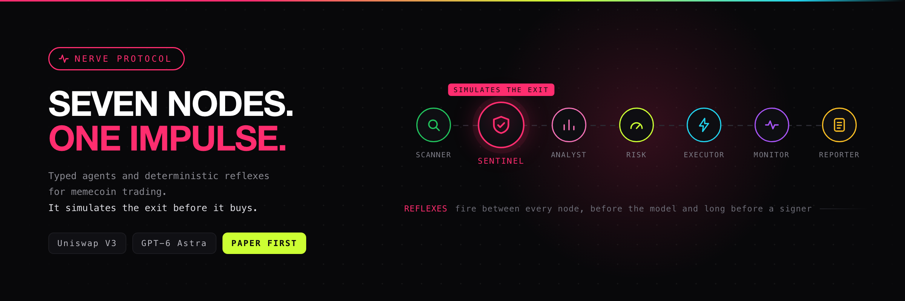

<div align="center">



# NERVE Protocol

**Seven typed agents and deterministic reflexes for memecoin trading.**
**It simulates the exit before it buys.**

[](https://github.com/h100envy/nerve/actions/workflows/ci.yml)
[](LICENSE)
[](pyproject.toml)
[](#quick-start)

[Quick start](#quick-start) ·
[Architecture](#the-impulse-path) ·
[SENTINEL](#sentinel-simulate-the-exit-before-the-entry) ·
[Roadmap](#roadmap) ·
[Docs](docs/nerve_protocol.md)

</div>

---

## What this is

NERVE is a protocol for memecoin trading on DEXes. Seven focused nodes pass one
typed message, `Impulse`, through a deterministic spine. Cheap reflexes stop a
rug, honeypot, taxed token, stale quote or exhausted risk budget **before** GPT
or a signer is called.

The first production adapter targets Uniswap V3 on Robinhood Chain. The source
interface also accepts Base and Solana adapters without changing the protocol.
NERVE is an independent project and is not affiliated with Robinhood.

## Where this is going

The protocol is the foundation, not the product. The goal is a public arena
where **many** trading bots run on one audited runtime: open-source strategies
found in the wild, ported behind a single interface, each one first proving
itself on paper with comparable numbers, and only then made available for real
trading with the user's own wallet.

One spine, one reflex layer, one audit trail — many strategies competing on the
same tape. See the [Roadmap](#roadmap).

## Status

| Layer | State |
| --- | --- |
| Protocol core, seven nodes, reflexes, score | ✅ shipped |
| SENTINEL round-trip simulation and tax measurement | ✅ shipped |
| Paper mode, no RPC, no key, no model | ✅ shipped |
| `nerve reconcile` read-only recovery | ✅ shipped |
| Live EVM execution with exactly-once send | ✅ shipped, **unproven against mainnet** |
| Pluggable strategy interface | ⬜ planned — [Phase 1](#phase-1--strategy-interface) |
| Strategy library from forked open-source bots | ⬜ planned — [Phase 2](#phase-2--strategy-library) |
| Comparable paper results | ⬜ planned — [Phase 3](#phase-3--comparable-results) |
| Public site and paper arena | ⬜ planned — [Phase 4](#phase-4--the-arena) |

Nothing here is a performance claim. The repository is an auditable starting
point.

## Why this is a protocol

The biological metaphor maps directly to code:

| NERVE concept | Engineering guarantee |
| --- | --- |
| Nerve specialization | Every node declares what it owns and its boundary. |
| Reflex | Deterministic checks run before expensive or side-effecting nodes. |
| Impulse | One Pydantic message carries facts and a complete transition history. |
| Spine | A router controls order and short-circuits on `REJECT`. |
| NerveStore | SQLite persists impulses, transitions and execution intents. |
| Score | The same metrics always produce the same 0–100 score. |

The model can write a thesis and confidence. It cannot select a wallet, alter a
size, bypass a reflex or send a transaction.

## Quick start

```bash
git clone https://github.com/h100envy/nerve.git
cd nerve
python3 -m venv .venv
.venv/bin/pip install -e '.[dev]'
cp .env.example .env
DB_PATH=/tmp/nerve.db KILL_SWITCH_FILE=/tmp/nerve-kill .venv/bin/nerve paper-scan
DB_PATH=/tmp/nerve.db .venv/bin/nerve reconcile
.venv/bin/ruff check . && .venv/bin/mypy src && .venv/bin/pytest -q
```

Paper mode uses synthetic observations, a `PaperSentinel` with fixed zero-tax
round-trip values and a paper fill adapter. It does not open an RPC connection,
import a key or call OpenAI. Set `OPENAI_API_KEY` to replace the paper analyst
with the Responses API and Structured Outputs.

| Command | What it does |
| --- | --- |
| `nerve paper-scan` | Full route on synthetic data. No RPC, no key, no model. |
| `nerve chain-check` | Reads chain ID, block and gas from the configured RPC. |
| `nerve preflight` | Verifies bytecode at WETH, factory, quoter and router. |
| `nerve reconcile` | Read-only recovery of unknown intents and open positions. |
| `nerve report` | Operational brief from the audited funnel. |
| `nerve run` | The live loop. Requires explicit live opt-in. |
| `nerve kill` | Trips the kill-switch file. |

### `nerve reconcile`

Run it before every restart of a live executor:

```bash
.venv/bin/nerve reconcile && .venv/bin/nerve run
```

It is read-only. It never builds, signs or sends a transaction, and it does not
construct the signer.

- Every intent with status `unknown` is resolved by nonce. The executor records
  the nonce and the locally computed hash of an uncertain send. Nonce at or
  above the wallet's pending nonce: `never_sent`. Nonce consumed: the receipt of
  the recorded hash sets `filled` or `reverted`. In the mempool, missing nonce or
  a nonce used by another transaction: left `unknown` and reported.
- Every open position is checked against the wallet's on-chain token balance. A
  position the wallet does not back is reported loudly and is never corrected.
- It prints a table and exits `1` on any divergence, `2` if it cannot read the
  chain, `0` when everything is backed. An empty store needs no RPC.

## The impulse path

```text
PoolSource → SCANNER → reflexes → SENTINEL (eth_call only, no model, no gas)
          → reflexes → ANALYST (GPT-6 Astra)
          → reflexes → RISK → reflexes → EXECUTOR
          → MONITOR → REPORTER
```

SENTINEL is free and deterministic, so it runs before the paid model call and
long before any signer. A token that cannot be sold is not a question worth
asking GPT.

An impulse is recoverable after a restart:

```text
scanner:pass(score=88) → sentinel:pass(block=65452122 buy_tax=0% sell_tax=0% flags=0)
  → analyst:pass(thesis) → risk:execute(size=$5000) → executor:fill(0x…)
```

### The seven nodes

Each declares what it owns and what it must never do. `NerveNode` refuses a
subclass without `node_type`, `owns` or `boundary` **at class definition time**,
so a future generalist node cannot silently cross responsibilities.

| Node | Owns | Boundary |
| --- | --- | --- |
| `SCANNER` | Normalizes pool observations and applies cheap deterministic filters | Does not call GPT, size positions, sign or send transactions |
| `SENTINEL` | Simulates a round trip from the real wallet and measures transfer tax | Never signs, never broadcasts, never asks the model, never guesses a missing value |
| `ANALYST` | Evaluates normalized pool metrics and returns a typed thesis | Never sees private keys, tools, gas limits or position size |
| `RISK` | Computes deterministic limits, size and stop geometry | Does not ask GPT for permission and never signs or sends a transaction |
| `EXECUTOR` | Creates an idempotent intent and delegates one paper/live execution | Does not change risk size, retry an unknown send or hide a revert |
| `MONITOR` | Watches positions, receipts, stops and liquidity drains | Does not reopen rejected entries or claim a stop exists on-chain |
| `REPORTER` | Turns the audited funnel into an operational brief | Does not alter positions, verdicts or transaction state |

## SENTINEL: simulate the exit before the entry

SENTINEL exists because of three verifiable gaps in the six-node version:

1. **The model was told about taxes nobody measured.** `Impulse` declares
   `buy_tax_pct` and `sell_tax_pct`, and ANALYST passes both to the model.
   Nothing in the repository assigned them, so they were always `None`.
2. **The Quoter does not prove your wallet can trade.** `_route_metrics` calls
   the Uniswap V3 Quoter, which runs pool math from the Quoter's own address. It
   cannot observe fee-on-transfer taxes (the token delivers less than
   `amountOut` without reverting), address blacklists, `onlyWhitelisted` gates,
   max-wallet limits, per-block anti-bot cooldowns or a `tradingEnabled` flag
   flipped after launch.
3. **Safety facts were manual and stale, and the score ignored the rest.**
   `mint_renounced`, `lp_locked`, `top10_pct` and `contract_verified` came from a
   hand-maintained JSON file, and `score.py` ignored `buy_route`, `sell_route`
   and both tax fields.

The fix, all pinned to one block number so every check sees the same state:

- **Round trip from the real wallet.** `eth_simulateV1` (the multi-call form of
  `eth_call`) funds `WALLET_ADDRESS` with native ETH by state override, wraps it,
  approves the router, buys at `SENTINEL_SIMULATE_SIZE_USD`, and in the next
  simulated block sells exactly the amount the buy delivered. A reverted or
  empty sell is a honeypot: reject.
- **Measured tax.** Buy tax is the Quoter's `amountOut` minus the observed token
  balance delta. Sell tax is the sell quote minus the observed WETH delta. Both
  are written to the Impulse, rounded up.
- **Bytecode scan.** `eth_getCode` on the token (and its EIP-1967
  implementation) is scanned for `PUSH4` selectors of blacklist, max-wallet,
  pause, trading toggle, mint, tax setters, fee exclusion, whitelist gates and
  transfer hooks. Matches become `bytecode:*` risk flags, not rejects.
- **On-chain enrichment.** `mint_renounced` from `owner()`/`getOwner()`;
  `lp_locked` from LP position holders against `LP_LOCKER_ALLOWLIST`; `top10_pct`
  from `INDEXER_URL` or a bounded `Transfer`-log window with a conservative upper
  bound. `ENRICHMENT_PATH` is only the fallback when a derivation is unavailable.
- **Freshness.** The pinned block and observation age go into
  `impulse.metadata["sentinel"]`; a simulation older than
  `SENTINEL_MAX_AGE_BLOCKS` is not trusted downstream.

Anything SENTINEL cannot derive stays `None` and fails closed at a reflex. The
full method, including what the simulation still cannot see, is in
[docs/sentinel.md](docs/sentinel.md).

## Reflexes

The built-in reflex set runs before SENTINEL, ANALYST, RISK and EXECUTOR:

- kill switch file;
- daily loss and maximum positions;
- gas cap;
- `sell_simulation_failed`: the sell leg reverted, was not simulated, or
  `sell_route` is false;
- `buy_tax_above_cap` and `sell_tax_above_cap`: tax above `MAX_BUY_TAX_PCT` /
  `MAX_SELL_TAX_PCT`, or unmeasured (`None` trips the cap, it never passes);
- `stale_simulation`: the pinned block is missing or older than
  `SENTINEL_MAX_AGE_BLOCKS`;
- minimum liquidity and maximum quote slippage;
- duplicate token position;
- minimum deterministic NERVE score.

The four SENTINEL reflexes guard ANALYST, RISK and EXECUTOR. A route without a
SENTINEL node therefore rejects everything. The first fired reflex writes a
`risk:reject` transition and the spine returns. This is the expensive-call and
side-effect boundary.

## Score

`nerve_score` is pure: same facts, same number. On top of liquidity, holder
concentration, mint, LP lock, slippage and volume:

- `sell_route` false: hard floor, the score is `0`;
- buy or sell tax above 10%: −20;
- both taxes exactly 0 with both routes true: +8;
- each distinct `bytecode:*` flag: −5, capped at −15.

## Package layout

```text
src/nerve/
├── models.py       # Impulse, Transition, observations and typed verdicts
├── protocol.py     # NerveNode contract and boundary enforcement
├── reflexes.py     # kill switch, loss, gas, simulation, tax, freshness, liquidity, slippage, position gates
├── spine.py        # ordered routing and short-circuiting
├── score.py        # deterministic 0–100 NERVE score
├── sources.py      # PoolSource protocol, paper source and enrichment file loader
├── adapters.py     # Robinhood Chain Uniswap V3 read adapter
├── chainread.py    # read-only JSON-RPC client; refuses signing and broadcast methods
├── rpc.py          # read retries, with exactly-once broadcast semantics
├── execution.py    # paper adapter and one-send EVM signer
├── reconcile.py    # read-only intent and position reconciliation
├── store.py        # SQLite audit trail and idempotent intents
├── agents/         # scanner, sentinel, analyst, risk, executor, monitor, reporter
└── desk.py         # composition root
```

## Robinhood Chain adapter

Robinhood Chain mainnet is EVM-compatible, uses chain ID `4663`, and pays gas in
ETH. Testnet is `46630`. The adapter reads Uniswap V3 factory pools, active V3
liquidity and `slot0`; the token universe is an explicit contract-address
allowlist. Symbols are never used as identity.

The default addresses in `NerveConfig` are the published Uniswap V3 deployment
values and remain configurable. Verify bytecode and addresses against the
[official Uniswap Robinhood Chain deployment page](https://developers.uniswap.org/docs/protocols/v3/deployments/v3-robinhood-chain-deployments)
before a live rollout. Use a managed provider such as Alchemy for production;
the [public Robinhood RPC](https://docs.robinhood.com/chain/connecting/) is
rate-limited and intended for development. SENTINEL needs a provider that
supports `eth_simulateV1`.

The source returns `PoolObservation`. Volume and contract verification are
enrichment fields from an indexer; holder concentration, mint and LP lock are
derived on-chain by SENTINEL when possible. Missing enrichment is represented as
an unsafe value and fails closed; it is never guessed. `ENRICHMENT_PATH` is a
JSON object keyed by token address. `ALLOW_ANY_TOKEN` enables bounded
`PoolCreated` log discovery; keep it false until contract review and a small
live allowlist are in place.

## GPT-6 Astra boundary

`AnalystNode` sends only normalized metrics, now including SENTINEL's measured
taxes, routes and bytecode flags. Its Structured Outputs schema is
`PASS | REJECT`, confidence, thesis and risk flags. The model may add risk flags;
it cannot erase SENTINEL's. It receives no private key, RPC client, wallet
address, transaction bytes, gas limit or position size. A failed model call
rejects the impulse. The risk and execution nodes are pure code and do not ask
the model for permission.

## Live execution contract

Live execution is opt-in and requires `EXECUTION_MODE=live`,
`LIVE_TRADING_ENABLED=true`, a separate hot wallet and a token allowlist. The
EVM adapter:

1. reads a fresh quote and computes `amountOutMinimum` from the configured
   slippage cap;
2. reads the `pending` nonce and builds an `exactInputSingle` call;
3. signs locally and calls `send_raw_transaction` exactly once;
4. waits for a receipt and configured confirmations;
5. records `tx_hash`, nonce and status in the store.

An RPC timeout after send is **unknown**, never a reason to resend. The intent
is marked `unknown` with its nonce and local hash, and `nerve reconcile`
resolves it. A revert means gas was spent. Approvals are separate transactions
and are also sent once.

There are no on-chain stop orders. MONITOR watches quotes and liquidity and
creates a separate exit impulse. A process restart must restore open positions
from the store and chain; in-memory state is not a source of truth.

## Environment

Copy `.env.example`. Keep `PRIVATE_KEY` in a secret manager or signer process;
never commit it or include it in an Impulse. For Robinhood Chain set:

```dotenv
CHAIN=robinhood
CHAIN_ID=4663
RPC_URL=https://robinhood-mainnet.g.alchemy.com/v2/<key>
TOKEN_ALLOWLIST=0xYourReviewedToken,0xAnotherReviewedToken
WETH_USD=2500
EXECUTION_MODE=paper
LIVE_TRADING_ENABLED=false
OPENAI_MODEL=gpt-6-astra

MAX_BUY_TAX_PCT=5
MAX_SELL_TAX_PCT=5
SENTINEL_MAX_AGE_BLOCKS=30
SENTINEL_SIMULATE_SIZE_USD=500
LP_LOCKER_ALLOWLIST=
INDEXER_URL=
UNISWAP_V3_POSITION_MANAGER=
```

Robinhood Chain targets 100 ms blocks, so `SENTINEL_MAX_AGE_BLOCKS=30` is about
three seconds. Size it against your provider latency and model call time, or
every impulse will be rejected as stale before RISK. Keep
`SENTINEL_SIMULATE_SIZE_USD` at or above the largest position RISK can size.

Start with `paper-scan`, then run `chain-check` and `preflight` against a
testnet or read-only provider. Move to a staffed, minimum-size live test only
after checking token bytecode, pool depth, the SENTINEL round trip, gas reserve,
approval state, receipt status and post-trade balances, and after
`nerve reconcile` exits `0`.

---

# Roadmap

The end state: a public arena where anyone can watch many open-source trading
bots run on the same audited runtime, compare them on identical data, and then
run the one they trust with their own wallet.

Each phase below has to hold before the next one is worth starting. Legend:
✅ shipped · 🚧 in progress · ⬜ planned.

### Phase 0 — Protocol core

**✅ Shipped.**

The audited substrate everything else stands on.

- [x] Seven typed nodes with enforced `owns` / `boundary` declarations
- [x] `Impulse` message with a complete, restart-recoverable transition history
- [x] Reflex layer ahead of every expensive or side-effecting node
- [x] Deterministic 0–100 score — same facts, same number
- [x] SENTINEL: wallet round-trip simulation, measured tax, bytecode scan
- [x] Paper mode with no RPC, no key and no model call
- [x] Exactly-once send with `unknown` as a terminal state, plus `nerve reconcile`
- [x] SQLite audit trail, MIT license, CI on 3.11 and 3.12

### Phase 1 — Strategy interface

**⬜ Planned. Prerequisite for every phase after it.**

Today the trading logic is fused into the spine: SCANNER's filters, `score.py`
and RISK's geometry **are** the strategy. One repository, one opinion. Every
later phase needs more than one.

- [ ] A `Strategy` protocol with the same discipline as `NerveNode`: it declares
      what it looks at, what it decides, and what it may never touch
- [ ] Strategy owns candidate selection, scoring and size/stop geometry —
      nothing else. No signer, no store, no reflex bypass, no RPC of its own
- [ ] Reflexes and SENTINEL stay **outside** the strategy and above it. A
      strategy can reject a trade; it can never approve one the reflexes refused
- [ ] Declared, validated parameters with defaults and ranges, so a strategy can
      be configured from a manifest instead of a code edit
- [ ] Current built-in logic extracted as the reference strategy, with the test
      suite unchanged as the proof the extraction was faithful
- [ ] Multiple strategies on one spine and one store, each tagged in the audit
      trail

### Phase 2 — Strategy library

**⬜ Planned. Needs Phase 1.**

Survey what already exists, port the good parts behind the Phase 1 interface.

- [ ] Survey open-source DEX/memecoin bots and published strategies — GitHub
      first, then research write-ups and public trading repos
- [ ] `strategies/<name>/` layout, each with a manifest: upstream URL, author,
      license, the idea in three sentences, and what was changed and why
- [ ] **Licenses decide the port, not taste.** MIT/Apache/BSD code can be
      vendored with attribution. GPL/AGPL code makes the derived work carry that
      license — those either live in their own repo or get reimplemented from
      the documented idea, never quietly relicensed. Unlicensed code is not
      open source and does not get copied at all
- [ ] Every ported strategy runs the full reflex layer and SENTINEL. Inherited
      logic does not inherit trust
- [ ] A porting checklist: upstream assumptions, hardcoded chains, missing exit
      logic, and what the original never checked

### Phase 3 — Comparable results

**⬜ Planned. Needs Phase 2.**

A leaderboard is worthless if two strategies saw different data. Before anything
is published, results have to be reproducible.

- [ ] A recorded tape: pool observations and SENTINEL results captured to disk
      with their pinned block, replayable offline
- [ ] Deterministic replay harness — every strategy against the same tape,
      same numbers on every run
- [ ] Forward paper accounts: one ledger per strategy, live data, no capital
- [ ] A metric set that is honest about memecoins: PnL, hit rate, max drawdown,
      median hold, gas paid, **and** reflex rejections, honeypots avoided and
      trades the strategy could not exit
- [ ] Results carry their input hash and code revision, so any published number
      can be reproduced from the repository

### Phase 4 — The arena

**⬜ Planned. Needs Phase 3.**

The site. Read-only first: watching costs nothing and risks nothing.

- [ ] Public leaderboard of strategies on paper, ranked with the Phase 3 metrics
- [ ] A page per strategy: manifest, upstream link and license, what was changed,
      live paper equity curve, and the full reflex-rejection log
- [ ] The impulse trace visible per trade — which node said what, and which
      reflex stopped the ones that never happened
- [ ] Anyone can start a paper run with their own parameters, no wallet and no
      key involved
- [ ] The whole site reads from the same store the CLI writes. No second source
      of truth, no hand-curated numbers

### Phase 5 — Real trading

**⬜ Planned. Needs Phase 4 and a paper history.**

Only after a strategy has a paper history the numbers can be reproduced from.

- [ ] Non-custodial by construction: the user's own RPC and own wallet. The site
      never holds funds and never receives a private key
- [ ] Promotion gates before a strategy may go live at all: a minimum paper
      history, a clean `nerve reconcile`, and a reviewed token allowlist
- [ ] Per-user caps — position size, daily loss, gas — enforced as reflexes, in
      code, not as site settings
- [ ] Kill switch reachable from the site and from the machine
- [ ] Starting size is minimum size, staffed, with the exit checked before the
      entry every single time

### Non-goals

Stated so they never quietly become goals:

- Custody of anyone's funds
- Selling signals, subscriptions or a token
- Backtest-only leaderboards — forward paper results or nothing
- A "just trust the model" mode: the model never gets the wallet, the size or
  the veto
- Performance claims the repository cannot reproduce from its own store

## License

MIT. See [LICENSE](LICENSE).
